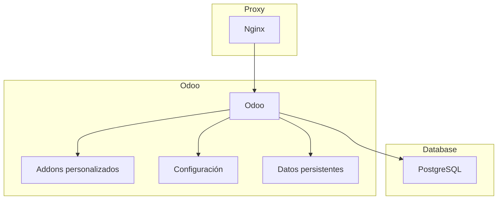

# Odoo with Podman Compose

Este proyecto levanta Odoo + Postgres usando `podman-compose`.

## 1) Configurar variables

1. Copia el ejemplo de entorno:

```bash
cp .env.example .env
```

Ejemplos listos por sistema:

```bash
cp .env.linux-selinux.example .env
# o
cp .env.windows.example .env
```

2. Edita `.env` y cambia al menos `DB_PASSWORD`.

### Compatibilidad Linux / Windows

- Linux con SELinux (Fedora/RHEL/CentOS): usa `BIND_MOUNT_SUFFIX=:Z` (o `:z`) en `.env`.
- Linux sin SELinux y Windows: deja `BIND_MOUNT_SUFFIX=` vacio.

## 2) Levantar servicios

```bash
podman-compose up -d
```

El acceso publico se hace por el proxy Nginx en `PUBLIC_HTTP_PORT` (por defecto `8070`).

## 3) Ver estado y logs

```bash
podman-compose ps
podman-compose logs -f
```

## 4) Acceso

- Odoo: `http://localhost:${PUBLIC_HTTP_PORT}` (por defecto `8070`)

## Arquitectura del Proyecto



### Descripción

- **Proxy (Nginx)**: Maneja las solicitudes HTTP y las redirige al servicio Odoo.
- **Odoo**: Contenedor principal que ejecuta la aplicación, con soporte para addons personalizados y configuración externa.
- **Base de datos (PostgreSQL)**: Almacena los datos de la aplicación.

### Notas

- La arquitectura utiliza un proxy inverso para proteger y gestionar el acceso a Odoo.
- Los volúmenes montados aseguran persistencia y flexibilidad.
- La configuración de healthcheck garantiza que los servicios se inicien en el orden correcto.

## Notas

- La arquitectura usa `proxy` (Nginx) delante de Odoo para no exponer Odoo directamente.
- `depends_on` usa `condition: service_healthy`, por lo que el arranque respeta salud de dependencias.
- Se incluyen `healthcheck` para `proxy`, `db` y `odoo`.
- Se aplican limites basicos de recursos y `no-new-privileges` en los contenedores.

## Cloud SQL (Google)

Este proyecto ahora puede usar Google Cloud SQL (PostgreSQL) como base de datos remota.

**Resumen:** Cloud SQL ofrece instancias gestionadas de PostgreSQL. Para conectar los contenedores puedes usar el Cloud SQL Auth Proxy (recomendado) o conectar por IP privada/publica según tu red.

- **Recomendado:** Ejecutar el Cloud SQL Auth Proxy como servicio en `docker-compose`/`podman-compose` y configurar Odoo para apuntar a ese proxy.
- **Alternativa:** Conexión por IP privada (VPC peering / Shared VPC) o IP pública (asegurar redes autorizadas y SSL).

**Ejemplo (servicio Cloud SQL Auth Proxy en `docker-compose.yml`):**

```yaml
    cloudsql-proxy:
        image: gcr.io/cloudsql-docker/gce-proxy:1.51.0
        command: ["/cloud_sql_proxy", "-instances=<PROJECT>:<REGION>:<INSTANCE>=tcp:0.0.0.0:5432", "-credential_file=/secrets/key.json"]
        volumes:
            - ./secrets:/secrets:ro
        restart: unless-stopped
        networks:
            - app

    odoo:
        # ... (mantener la configuración existente)
        environment:
            - DB_HOST=cloudsql-proxy
            - DB_PORT=5432
            - DB_USER=<DB_USER>
            - DB_PASSWORD=<DB_PASSWORD>
            - DB_NAME=<DB_NAME>
        networks:
            - app
```

En el ejemplo anterior, el proxy escucha en el puerto `5432` dentro de la red `app` y Odoo se conecta a `cloudsql-proxy:5432`.

**Configurar `config/odoo.conf`:**

Evita dejar credenciales en el repositorio. Reemplaza valores fijos por marcadores o monta el archivo desde fuera del repo. Ejemplo mínimo:

```
[options]
admin_passwd = <admin_password>
db_host = cloudsql-proxy
db_port = 5432
db_user = <DB_USER>
db_password = <DB_PASSWORD>
db_name = <DB_NAME>
```

Otras opciones seguras:
- Usar variables de entorno y generar `odoo.conf` en tiempo de arranque.
- Almacenar credenciales en Secret Manager y volcar en `./secrets` para el proxy/servicios.

**Pasos básicos para migrar datos (desde un dump local):**

1. Crear la instancia Cloud SQL (Postgres) en Google Cloud Console.
2. Crear usuario y base de datos en la instancia Cloud SQL.
3. Provisionar una cuenta de servicio y descargar la clave JSON (colócala en `./secrets/key.json`).
4. Levantar `cloudsql-proxy` con la cuenta de servicio (ver `docker-compose` ejemplo arriba).
5. Desde una máquina con `psql` o dentro del contenedor `cloudsql-proxy`/otro contenedor, restaurar el dump:

```bash
PGPASSWORD=<DB_PASSWORD> psql -h 127.0.0.1 -U <DB_USER> -d <DB_NAME> -f taller.sql
# o con pg_restore si tienes un dump en formato custom:
pg_restore -h 127.0.0.1 -U <DB_USER> -d <DB_NAME> backup.dump
```

