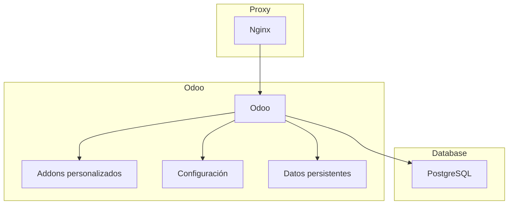

# Odoo with Podman Compose

Este proyecto levanta Odoo + Postgres usando `podman-compose`.

## 1) Configurar variables

1. Copia el ejemplo de entorno:

```bash
cp .env.example .env
```

Ejemplos listos por sistema:

```bash
cp .env.linux-selinux.example .env
# o
cp .env.windows.example .env
```

2. Edita `.env` y cambia al menos `DB_PASSWORD`.

### Compatibilidad Linux / Windows

- Linux con SELinux (Fedora/RHEL/CentOS): usa `BIND_MOUNT_SUFFIX=:Z` (o `:z`) en `.env`.
- Linux sin SELinux y Windows: deja `BIND_MOUNT_SUFFIX=` vacio.

## 2) Levantar servicios

```bash
podman-compose up -d
```

El acceso publico se hace por el proxy Nginx en `PUBLIC_HTTP_PORT` (por defecto `8070`).

## 3) Ver estado y logs

```bash
podman-compose ps
podman-compose logs -f
```

## 4) Acceso

- Odoo: `http://localhost:${PUBLIC_HTTP_PORT}` (por defecto `8070`)

## Arquitectura del Proyecto



### Descripción

- **Proxy (Nginx)**: Maneja las solicitudes HTTP y las redirige al servicio Odoo.
- **Odoo**: Contenedor principal que ejecuta la aplicación, con soporte para addons personalizados y configuración externa.
- **Base de datos (PostgreSQL)**: Almacena los datos de la aplicación.

### Notas

- La arquitectura utiliza un proxy inverso para proteger y gestionar el acceso a Odoo.
- Los volúmenes montados aseguran persistencia y flexibilidad.
- La configuración de healthcheck garantiza que los servicios se inicien en el orden correcto.

## Notas

- La arquitectura usa `proxy` (Nginx) delante de Odoo para no exponer Odoo directamente.
- `depends_on` usa `condition: service_healthy`, por lo que el arranque respeta salud de dependencias.
- Se incluyen `healthcheck` para `proxy`, `db` y `odoo`.
- Se aplican limites basicos de recursos y `no-new-privileges` en los contenedores.
