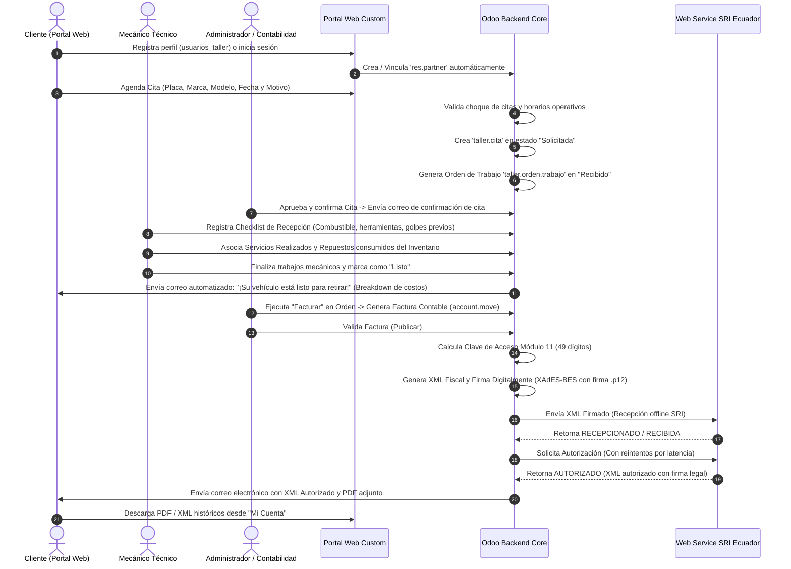

# Terrabyte EC - Sistema de Gestión de Taller Mecánico Automotriz en Odoo 18

Este repositorio contiene el código fuente, la configuración del entorno y los módulos personalizados para el **Sistema de Gestión de Taller Mecánico Automotriz** de la empresa **Terrabyte EC**, desarrollado sobre la plataforma ERP **Odoo 18**.

---

## 1. General Description

### El Problema
La gestión operativa de los talleres mecánicos tradicionales suele sufrir de una alarmante desconexión entre sus diferentes etapas: desde que un cliente solicita una cita, pasando por la recepción e inspección técnica del vehículo, el control de inventario de repuestos utilizados, hasta la facturación y el registro contable final. Esta falta de integración produce cuellos de botella administrativos, pérdida de trazabilidad en los historiales de mantenimiento y demoras críticas en el cumplimiento fiscal de la facturación electrónica.

### Contexto de Negocio
**Terrabyte EC** es un taller automotriz de vanguardia ubicado en el mercado ecuatoriano. Para competir de manera efectiva en el sector del mantenimiento de vehículos de pasajeros e industriales, Terrabyte EC requiere una plataforma centralizada que no solo organice sus operaciones mecánicas cotidianas, sino que además ofrezca una experiencia premium al cliente a través de un portal web de autoservicio y cumpla rigurosamente con los requisitos fiscales exigidos por el **Servicio de Rentas Internas (SRI)** de Ecuador.

### Objetivo del Sistema
Digitalizar y automatizar el flujo operativo end-to-end de Terrabyte EC mediante una suite integrada en Odoo 18. El sistema centraliza la captación web de citas, la asignación automática de técnicos, el seguimiento detallado de hojas de trabajo (Work Orders), el descuento automático de stock de repuestos y la emisión de facturas electrónicas legalmente autorizadas por el SRI de Ecuador mediante firmas digitales en formato XAdES-BES.

---

## 2. Project Objectives

- **Centralización Operativa:** Unificar la gestión de clientes, vehículos, citas, órdenes de trabajo, inventarios y finanzas bajo una base de datos relacional única.
- **Automatización de Recepción y Control:** Proveer listas de verificación (checklists) interactivas para recepcionar vehículos, registrar kilometraje, nivel de combustible y estado físico.
- **Sincronización Inteligente de Catálogos:** Integrar el sistema de marcas y modelos con servicios externos oficiales (NHTSA API) para evitar la introducción manual de datos erróneos de vehículos.
- **Integración Fiscal Automatizada:** Implementar la facturación electrónica nativa del Ecuador (offline SRI) mediante generación dinámica de XML, firma con certificados `.p12` y transmisión SOAP automática en tiempo real.
- **Portal de Autoservicio (Customer Experience):** Facilitar a los clientes de Terrabyte EC el registro de cuentas, la visualización en tiempo real del estado de sus órdenes de trabajo ("Recibido", "Listo", "Entregado"), la agenda automatizada de citas y la descarga directa de sus documentos tributarios (PDF/XML).
- **Gestión de Recursos Humanos Eficiente:** Automatizar el alta de perfiles técnicos para mecánicos y la asignación inteligente de tareas con base en su cargo y disponibilidad.

---

## 3. General Architecture

La solución de software de **Terrabyte EC** adopta una arquitectura multicapa, apoyándose en la robustez modular de Odoo y su arquitectura Modelo-Vista-Controlador (MVC), combinada con servicios auxiliares externalizados.

```mermaid
graph TD
    subgraph Capa de Presentacion [Capa de Presentación & Acceso]
        ClientBrowser[Navegador del Cliente / Portal Web]
        AdminBrowser[Cliente Odoo Backend / Administrador]
        NginxProxy[Proxy Inverso Nginx]
    end

    subgraph Capa de Negocio [Capa de Lógica de Negocio - Odoo 18]
        OdooCore[Odoo ERP Core]
        
        subgraph Modulos Estandar [Módulos Estándar Utilizados]
            ModWebsite[Website & E-Commerce]
            ModInventory[Inventory & Stock]
            ModPurchase[Purchase & Stock Intake]
            ModSales[Sales & Quotations]
            ModAccount[Accounting & Moves]
            ModEmployees[HR Employees]
            ModContacts[Contacts & Partners]
        end
        
        subgraph Modulos Personalizados [Módulos Custom Terrabyte EC]
            AddonUsers[usuarios_taller]
            AddonCore[taller_mecanico]
            AddonAdmin[taller_mecanico_admin]
            AddonPortal[taller_mecanico_portal]
            AddonTech[taller_mecanico_tecnico]
        end
    end

    subgraph Capa de Datos [Capa de Persistencia de Datos]
        PostgreSQL[(PostgreSQL 15/18 Database)]
    end

    subgraph Integraciones [Integraciones Externas]
        NHTSA_API[US NHTSA Vehicles API]
        SRI_WS[Servicio de Rentas Internas SRI WS SOAP]
    end

    ClientBrowser -->|HTTP/HTTPS Puerto 8070| NginxProxy
    AdminBrowser -->|HTTP/HTTPS Puerto 8070| NginxProxy
    NginxProxy -->|Redirección Interna| OdooCore
    
    OdooCore --> Modulos Estandar
    OdooCore --> Modulos Personalizados
    
    AddonCore -->|Sincronización de Autos| NHTSA_API
    AddonCore -->|Envío de Facturas Firmadas| SRI_WS
    
    OdooCore -->|Conexión Contenedor DB| PostgreSQL
```

### Componentes de la Arquitectura
1. **Módulos Estándar Odoo:** Proveen la base transaccional sólida para la venta, la compra de insumos, el control de stock en bodegas, el manejo de nómina de empleados y la contabilidad fiscal.
2. **Módulos Custom (Terrabyte EC):** Encapsulan la lógica de taller mecánico, la sincronización externa de vehículos, las vistas restringidas para mecánicos, el portal personalizado de seguimiento y el procesador de firma digital para el SRI.
3. **Capa de Persistencia (PostgreSQL):** Almacenamiento relacional aislado de todas las entidades transaccionales del taller, contabilidad y portal de usuarios.
4. **Integraciones:** 
   - **NHTSA API:** Consume endpoints REST para recuperar e importar marcas y modelos vehiculares en tiempo real.
   - **SRI Ecuador:** Transmite solicitudes y recibe respuestas a través de mensajería XML SOAP (offline billing model).

---

## 4. Main Functionalities

A continuación, se detallan las funcionalidades principales del sistema y los usuarios asociados a cada una:

| Módulo / Componente | Funcionalidad Clave | Roles de Usuario Asociados |
| :--- | :--- | :--- |
| **Website & Portal** | - Navegación de servicios y catálogos de repuestos.<br>- Reserva de citas online con verificación de disponibilidad en tiempo real.<br>- Consulta interactiva del estado del vehículo ingresando la placa.<br>- Visualización de historial de servicios y descarga de facturas en PDF/XML. | Clientes del Taller (Público y Registrados) |
| **Taller Mecánico (Core)** | - Registro de fichas de vehículos (Placa, Marca, Modelo, Año, Color, Combustible).<br>- Gestión del ciclo de vida de Citas de Revisión ("Solicitada", "Confirmada", "Cancelada").<br>- Creación automática de Órdenes de Trabajo vinculadas a la cita.<br>- Transición de estados de reparación ("Recibido", "Listo", "Entregado"). | Recepcionista, Jefe de Taller, Administradores |
| **usuarios_taller** | - Registro y validación estricta de perfiles de clientes (Cédula ecuatoriana única, celular numérico, edad > 18).<br>- Sincronización automática bidireccional de perfiles con Odoo Contacts (`res.partner`). | Cliente (Web), Administrador de Sistema |
| **taller_mecanico_tecnico**| - Vista simplificada y adaptada para mecánicos (solo ven sus Órdenes de Trabajo asignadas).<br>- Registro del Checklist de Recepción (Nivel de combustible, herramientas, llanta de repuesto, gata, daños previos).<br>- Registro de líneas de servicios y repuestos utilizados en tiempo real.<br>- Creación automática de usuarios Odoo en el alta de un empleado técnico. | Técnicos / Mecánicos del Taller |
| **taller_mecanico_admin** | - Facturación automática a partir de los insumos y mano de obra de la orden.<br>- Configuración centralizada de firmas electrónicas `.p12` y contraseñas por compañía.<br>- SRI Dashboard para monitoreo de documentos autorizados, rechazados y enviados.<br>- Descarga masiva en archivo ZIP de facturas XML para auditorías internas. | Administradores del Taller, Contadores |
| **Inventory & Purchase** | - Control de stock de repuestos y materias primas (lubricantes, filtros, etc.).<br>- Alertas de desabastecimiento e importación de listas de compra para reabastecimiento. | Bodeguero, Compradores |
| **Accounting** | - Registro de asientos contables automáticos generados por la facturación de servicios.<br>- Liquidación de impuestos (IVA 15% / 0% según regulaciones de Ecuador). | Contadores, Auditores de Finanzas |

---

## 5. Prerequisites

Para desplegar la aplicación de forma local o en producción, es necesario contar con los siguientes componentes en el host:

- **Docker:** Versión `20.10.0` o superior.
- **Docker Compose:** Versión `v2.0.0` o superior (o en su defecto `podman-compose` para sistemas basados en Podman).
- **Odoo Image:** `odoo:18.0` (Basado en Debian Bookworm, Python `3.11.x` o `3.12.x`).
- **PostgreSQL:** Versión `15` (recomendado) o `18-alpine` (conforme a la configuración declarada en `docker-compose.yml`).
- **Librerías Python adicionales** (inyectadas en Odoo para firmas electrónicas y llamadas externas):
  - `requests` (para API NHTSA y SRI Web Services).
  - `lxml` (para manipulación de estructuras XML de facturas).
  - `cryptography` / `pyOpenSSL` (requeridas para cifrado y firma XAdES-BES en `xades_bes_sri_ec`).

---

## 6. Installation & Deployment

Siga estos pasos estructurados para instalar y poner en marcha la solución de **Terrabyte EC** desde cero:

### Paso 1: Clonar el Repositorio
```bash
git clone https://github.com/tu-usuario/Mechanic_Workshop.git
cd Mechanic_Workshop
```

### Paso 2: Crear el Archivo de Configuración de Entorno (`.env`)
Copie el ejemplo de variables de entorno adecuado para su sistema operativo:
```bash
# En sistemas Windows:
copy .env.windows.example .env

# En sistemas Linux con SELinux (Fedora/RHEL/CentOS):
cp .env.linux-selinux.example .env

# En sistemas Linux estándar / MacOS:
cp .env.example .env
```

### Paso 3: Revisar y Personalizar las Variables
Abra el archivo `.env` en su editor de preferencia y ajuste las siguientes credenciales críticas de seguridad:
```env
DB_PASSWORD=una_contraseña_altamente_segura_para_el_taller
PUBLIC_HTTP_PORT=8070
```

### Paso 4: Levantar la Infraestructura en Contenedores
Inicie los servicios en segundo plano usando Docker Compose (o Podman):
```bash
docker-compose up -d
```
*Si utiliza Podman en su lugar:*
```bash
podman-compose up -d
```

Este comando levantará tres servicios clave de red:
1. `odoo-db-das` (Base de datos PostgreSQL en el puerto interno 5432).
2. `odoo18` (Instancia de Odoo con el volumen de addons personalizados montado).
3. `odoo-proxy` (Servidor Nginx configurado como proxy inverso para Odoo).

---

## 7. Environment Configuration

### Estructura de Redes y Seguridad
La infraestructura de red de Terrabyte EC está dividida en dos segmentos lógicos:
- **Red `edge` (Pública):** Permite la comunicación exterior del cliente con el proxy Nginx en el puerto público `8070`.
- **Red `app` (Privada e Interna):** Aísla los contenedores de Odoo y PostgreSQL del tráfico directo de Internet. Solo el proxy Nginx tiene comunicación cruzada entre ambas redes, garantizando la seguridad perimetral de los datos financieros.

### Archivos de Configuración Relevantes
- **[config/odoo.conf](file:///d:/universidad/septimo/DAS/Mechanic_Workshop/config/odoo.conf):** Configura los parámetros operativos de Odoo, incluyendo las rutas de addons (`/mnt/extra-addons`), nivel de log (`info`), y los límites de memoria física (`limit_memory_hard` en 2.5 GB, `limit_memory_soft` en 2.0 GB) y tiempo de procesamiento (CPU time limit en 600 segundos) para prevenir fugas de recursos en el servidor.
- **[docker-compose.yml](file:///d:/universidad/septimo/DAS/Mechanic_Workshop/docker-compose.yml):** Define los límites de recursos de hardware para cada servicio (por ejemplo, Odoo tiene un límite de `mem_limit: 2g` y `cpus: 2.0` para evitar bloqueos del host).

---

## 8. Dependencies Table

El ecosistema de módulos personalizados de **Terrabyte EC** está fuertemente estructurado bajo una jerarquía estricta de dependencias:

| Módulo Personalizado | Dependencias Estándar Odoo / Custom | Propósito de la Dependencia |
| :--- | :--- | :--- |
| **`usuarios_taller`** | `base` | Acceso a las estructuras base de Odoo (`res.partner`, `res.users`). |
| **`taller_mecanico`** | `stock`, `sale`, `account`, `usuarios_taller`, `contacts`, `hr`, `mail`, `payment_stripe`, `payment_paypal` | Integración del core de vehículos y citas con inventario, ventas, nómina de empleados, plantillas de correo, pasarelas de pago y perfiles de usuario. |
| **`taller_mecanico_tecnico`**| `taller_mecanico`, `hr` | Acceso a órdenes de trabajo y vinculación con la hoja de vida de empleados técnicos. |
| **`taller_mecanico_admin`** | `taller_mecanico` | Extensión de facturación de Odoo, SRI dashboards y reportes impresos de comprobantes legales. |
| **`taller_mecanico_portal`**| `taller_mecanico`, `website`, `website_sale`, `usuarios_taller` | Habilitación de rutas web públicas, controladores de registro, inicio de sesión y compras desde el e-commerce. |

---

## 9. Repository Structure

La organización del código fuente del proyecto se estructura de la siguiente manera:

```text
Mechanic_Workshop/
│
├── addons/                             # Módulos de Odoo 18 (Suite Custom y Temas)
│   ├── muk_web_theme/                  # Tema visual premium adaptado para móviles (MuK IT)
│   ├── muk_web_chatter/                # Extensiones visuales para el módulo de chat y logs
│   ├── muk_web_dialog/                 # Rediseño visual de cuadros de diálogo y modals
│   ├── muk_web_colors/                 # Paletas y variables cromáticas premium
│   ├── muk_web_appsbar/                # Menú de aplicaciones superior rediseñado
│   │
│   ├── usuarios_taller/                # Módulo custom: Perfiles de clientes y validaciones
│   │   ├── models/user_profile.py      # Modelo usuarios_taller.user_profile y triggers con res.partner
│   │   ├── security/ir.model.access.csv# Permisos administrativos de perfiles
│   │   └── views/user_profile_views.xml# Vistas y formularios del perfil
│   │
│   ├── taller_mecanico/                # Módulo custom: Core operativo de la solución
│   │   ├── data/                       # Carga de datos base (productos de demo y stock inicial)
│   │   ├── models/                     # Modelos principales
│   │   │   ├── cita.py                 # Modelo taller.cita e interactores de email
│   │   │   ├── vehiculo.py             # Modelo taller.vehiculo y validaciones
│   │   │   ├── orden_trabajo.py        # Modelo taller.orden.trabajo y líneas
│   │   │   ├── marca_modelo.py         # Sincronización NHTSA (taller.marca, taller.modelo)
│   │   │   ├── marca_wizard.py         # Wizard de búsqueda interactiva de marcas
│   │   │   ├── account_move.py         # Extensión account.move para SRI Ecuador
│   │   │   ├── sri_utils.py            # Generación de XML, firma XAdES-BES y llamadas SOAP SRI
│   │   │   └── xades_bes_sri_ec/       # Biblioteca interna para firma digital de facturas
│   │   ├── security/                   # Reglas de registro y seguridad CSV
│   │   └── views/                      # Formularios, árboles, tableros y menús backend
│   │
│   ├── taller_mecanico_tecnico/        # Módulo custom: Interfaz simplificada y automatización de técnicos
│   │   ├── models/hr_employee.py       # Extensión hr.employee para autoprovisionamiento de accesos
│   │   └── views/tecnico_menus.xml     # Menús y Smart Buttons exclusivos
│   │
│   ├── taller_mecanico_admin/          # Módulo custom: Contabilidad y tableros SRI
│   │   └── views/                      # Sri Dashboard, SRI Invoice QWeb Reports
│   │
│   └── taller_mecanico_portal/         # Módulo custom: Sitio web y control de citas público
│       ├── controllers/                # Controladores HTTP de rutas web
│       │   ├── main.py                 # Flujo de citas, cuentas, login y consultas de placas
│       │   ├── shop.py                 # E-commerce custom de repuestos
│       │   └── sri_controller.py       # Descargas seguras de XML tributarios
│       ├── static/                     # Estilos SCSS premium, variables visuales y scripts JS
│       └── views/pages/                # Páginas XML integradas en el motor QWeb de Website
│
├── config/                             # Archivos de configuración del servidor
│   ├── nginx/                          # Configuración de proxy inverso de Nginx
│   └── odoo.conf                       # Opciones operativas de Odoo 18
│
├── data_import/                        # Archivos de datos reales e históricos para importación masiva
│   ├── clientes_template.csv           # Lista de clientes predefinidos
│   ├── productos_template.csv          # Lista de repuestos automotrices catalogados
│   ├── empleados_taller.csv            # Lista de nómina e ingenieros mecánicos
│   └── solicitudes_cotizacion_compras.csv # Historial de órdenes de compra
│
├── docker-compose.yml                  # Configuración de despliegue en microservicios
├── README.md                           # Documentación técnica principal
├── .env.example                        # Ejemplo base de variables de entorno
├── .env.windows.example                # Ejemplo de variables adaptado a Windows
└── .env.linux-selinux.example          # Ejemplo de variables adaptado a Linux con SELinux
```

---

## 10. Running the Project

Para iniciar, detener o depurar el sistema de **Terrabyte EC**, utilice los siguientes comandos estandarizados en su terminal de control:

### Levantar los Contenedores
```bash
docker-compose up -d
```

### Detener los Servicios y Conservar los Datos
```bash
docker-compose down
```

### Detener los Servicios Eliminando los Volúmenes (Reinicio Completo)
> [!WARNING]
> Este comando eliminará todos los datos almacenados en la base de datos y archivos cargados. Úselo con extrema precaución.
```bash
docker-compose down -v
```

### Ver Logs del Servidor de Odoo en Tiempo Real
```bash
docker-compose logs -f odoo
```

### Verificar el Estado de Salud (Health Status) de los Contenedores
```bash
docker-compose ps
```

---

## 11. System Workflow

El flujo operativo integrado de **Terrabyte EC** modela el viaje completo del cliente y la intervención técnica hasta el cobro final:


```mermaid
sequenceDiagram
    autonumber
    actor Cliente as Cliente (Portal Web)
    actor Tecnico as Mecánico Técnico
    actor Admin as Administrador / Contabilidad
    participant Portal as Portal Web Custom
    participant Odoo as Odoo Backend Core
    participant SRI as Web Service SRI Ecuador

    %% Fase 1: Agenda de Cita y Alta del Auto
    Cliente->>Portal: Registra perfil (usuarios_taller) o inicia sesión
    Portal->>Odoo: Crea / Vincula 'res.partner' automáticamente
    Cliente->>Portal: Agenda Cita (Placa, Marca, Modelo, Fecha y Motivo)
    Odoo->>Odoo: Valida choque de citas y horarios operativos
    Odoo->>Odoo: Crea 'taller.cita' en estado "Solicitada"
    Odoo->>Odoo: Genera Orden de Trabajo 'taller.orden.trabajo' en "Recibido"

    %% Fase 2: Diagnóstico e Inspección Técnica
    Admin->>Odoo: Aprueba y confirma Cita -> Envía correo de confirmación de cita
    Tecnico->>Odoo: Registra Checklist de Recepción (Combustible, herramientas, golpes previos)
    Tecnico->>Odoo: Asocia Servicios Realizados y Repuestos consumidos del Inventario
    Tecnico->>Odoo: Finaliza trabajos mecánicos y marca como "Listo"
    Odoo->>Cliente: Envía correo automatizado: "¡Su vehículo está listo para retirar!" (Breakdown de costos)

    %% Fase 3: Facturación y Validación Fiscal
    Admin->>Odoo: Ejecuta "Facturar" en Orden -> Genera Factura Contable (account.move)
    Admin->>Odoo: Valida Factura (Publicar)
    Odoo->>Odoo: Calcula Clave de Acceso Módulo 11 (49 dígitos)
    Odoo->>Odoo: Genera XML Fiscal y Firma Digitalmente (XAdES-BES con firma .p12)
    Odoo->>SRI: Envía XML Firmado (Recepción offline SRI)
    SRI-->>Odoo: Retorna RECEPCIONADO / RECIBIDA
    Odoo->>SRI: Solicita Autorización (Con reintentos por latencia)
    SRI-->>Odoo: Retorna AUTORIZADO (XML autorizado con firma legal)
    Odoo->>Cliente: Envía correo electrónico con XML Autorizado y PDF adjunto
    Cliente->>Portal: Descarga PDF / XML históricos desde "Mi Cuenta"
```

1. **Agenda & Registro:** El cliente ingresa a `taller/cita`, registra sus datos personales (Cédula/Email) y de su auto. Si es nuevo, el sistema crea dinámicamente un perfil de usuario y lo sincroniza con `res.partner`.
2. **Inspección Técnica:** Al ingresar al taller, la orden de trabajo creada automáticamente pasa a "Recibido". El técnico asignado completa el checklist físico, asocia los repuestos usados (descontándolos de `stock`) y los servicios prestados.
3. **Notificación:** Al marcar la orden como "Listo", se recalcula el millaje del vehículo y se despacha un correo HTML interactivo detallando cada rubro cobrado.
4. **Cierre Fiscal & Cobro:** El administrador genera la factura desde la orden. Al publicarse, Odoo calcula la clave de acceso Mod 11, firma digitalmente con el certificado `.p12` de la compañía y realiza las transmisiones SOAP al SRI (Recepción y Autorización). Tras ser autorizada, el cliente recibe el correo final con el XML y el PDF de la factura adjuntos.

---

## 12. Required Screenshots

Para validar la correcta implementación visual y funcional de la plataforma de **Terrabyte EC**, el desarrollador deberá incorporar capturas de pantalla reales en los siguientes marcadores de posición:

### Panel de Control SRI & Dashboard Administrativo

*Mapeo sugerido:* Pantalla principal en `taller_mecanico_admin` mostrando estadísticas de facturas autorizadas, rechazadas y en proceso ante el SRI.

### Ficha de Identificación del Vehículo

*Mapeo sugerido:* Formulario de `taller.vehiculo` que muestra la marca, modelo sincronizado por API, propietario y su historial de órdenes.

### Reserva de Cita Automotriz en el Portal

*Mapeo sugerido:* Interfaz de cliente en el portal web público (`taller/cita`) completando datos del auto y fecha con el validador dinámico de choques.

### Orden de Trabajo en el Backend (Checklist y Líneas)

*Mapeo sugerido:* Formulario `taller.orden.trabajo` mostrando el checklist de recepción física, servicios y repuestos ingresados por el mecánico.

### Control de Inventarios de Repuestos

*Mapeo sugerido:* Lista de productos de tipo storable mostrando stock disponible (`qty_available`) posterior a la entrega del auto.

### Representación de Factura Electrónica y Clave SRI

*Mapeo sugerido:* Registro de factura en `account.move` mostrando el campo de Clave de Acceso de 49 dígitos y estado "autorizado" con el XML firmado adjunto.

### Portal Web del Cliente (Mi Cuenta)

*Mapeo sugerido:* Interfaz "Mi Cuenta" del portal mostrando la lista de autos registrados, citas programadas y facturas descargables en XML y PDF.

---

## 13. Maintenance Guide

Para desarrolladores que asuman el mantenimiento futuro del sistema de **Terrabyte EC**, se definen los siguientes estándares de oro:

- **Evolución de Modelos:** Evite modificar modelos core directamente en `taller_mecanico`. Utilice la herencia de Odoo (`_inherit`) en submódulos dedicados para extender funcionalidades.
- **Validaciones en Base de Datos:** Todo campo crítico de identificación de clientes o vehículos debe ir protegido con restricciones SQL (`_sql_constraints`) combinadas con validaciones de Python (`@api.constrains`) para asegurar la integridad de los datos transaccionales.
- **Seguridad y Control de Accesos:** Al crear nuevos modelos, registre obligatoriamente sus permisos CRUD en `ir.model.access.csv`. Si el modelo requiere restricciones lógicas de visibilidad por rol de usuario, implemente Reglas de Registro (`ir.rule`) dentro de `security/taller_security.xml`.
- **Mantenimiento de Firmas SRI:** El certificado de firma electrónica `.p12` se almacena como binario. En caso de caducidad de firmas de producción, la actualización se hace exclusivamente a través de la configuración de la compañía por UI backend sin requerir cambios de código ni reinicios de contenedores.
- **Versionamiento de APIS:** NHTSA API puede cambiar el formato de respuesta de sus vehículos. Los métodos de sincronización en `marca_modelo.py` están encapsulados en bloques `try-except` para evitar caídas catastróficas del hilo del cliente ante inestabilidades del servicio de la NHTSA.

---

## 14. Common Issues & Solutions

A continuación se listan las fallas operativas más comunes y sus respectivas contramedidas técnicas:

| Problema / Síntoma | Causa Probable | Solución Desarrollador / Administrador |
| :--- | :--- | :--- |
| **Error: "El SRI rechazó el comprobante durante la recepción: [ERROR 50] Firma inválida"** | La firma electrónica `.p12` cargada en los ajustes de compañía ha caducado, la contraseña es errónea, o el formato del archivo es incorrecto. | 1. Ingrese a Ajustes → Compañía pestaña "SRI Ecuador".<br>2. Verifique y re-suba el certificado `.p12` vigente.<br>3. Asegúrese de escribir la contraseña de firma sin caracteres de control ocultos. |
| **Error: "Ninguno de los vehículos muestra modelos al cambiar de Marca en el Portal"** | No se ha ejecutado la sincronización inicial de modelos desde la API externa de NHTSA para esa marca específica. | Ingrese al Odoo backend como Administrador, vaya a Configuración → Marcas de Vehículos, seleccione la marca y pulse el botón "Sincronizar Modelos (Esta Marca)". |
| **Error: "El taller está cerrado los domingos" al reservar desde la Web** | El validador dinámico de Odoo en `taller_cita_submit` interceptó un intento de reserva en fin de semana bloqueando la inserción. | El comportamiento es correcto conforme a las políticas comerciales. Si requiere habilitar citas dominicales, modifique la lógica en [main.py](file:///d:/universidad/septimo/DAS/Mechanic_Workshop/addons/taller_mecanico_portal/controllers/main.py#L161-L162). |
| **Error: "Debe registrar al menos un servicio, repuesto o costo de mano de obra"** | Se intentó hacer la transición operativa de la Orden de Trabajo de "Recibido" a "Listo" sin agregar insumos ni costos. | Abra la Orden de Trabajo, agregue al menos una línea en la pestaña "Servicios Realizados" o "Repuestos Utilizados", o asigne un "Costo Técnico Fijo" de mano de obra antes de intentar cambiar el estado. |
| **Error de Red: "Excepción de conexión SRI Recepción"** | El servidor de pruebas del SRI de Ecuador se encuentra fuera de servicio (caída de sistemas gubernamentales). | La factura queda guardada localmente en estado "borrador" de SRI. El sistema está diseñado de forma tolerante a fallas; una vez que los servicios del SRI se restablezcan, el administrador puede facturar manualmente pulsando el botón contable "Generar y Firmar XML (SRI)". |
