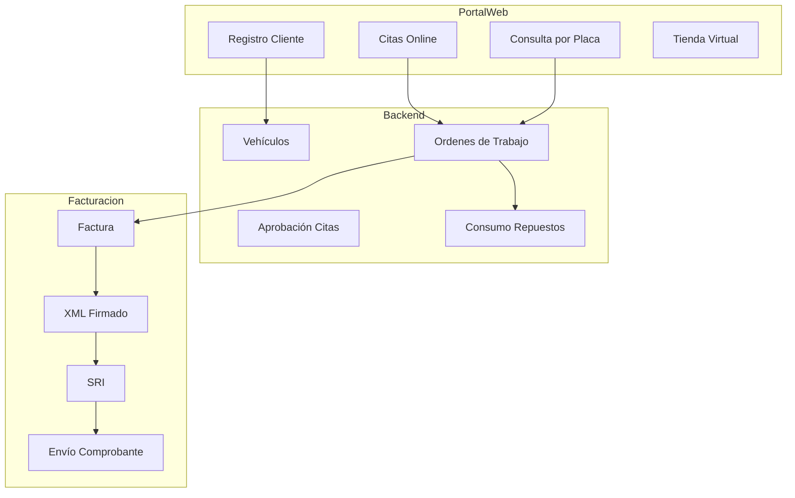
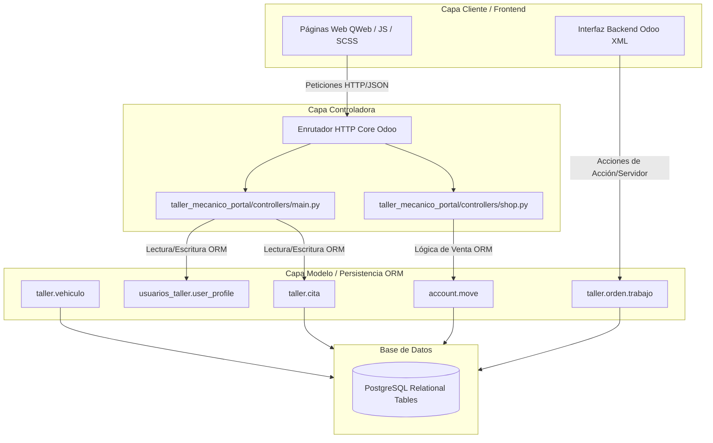
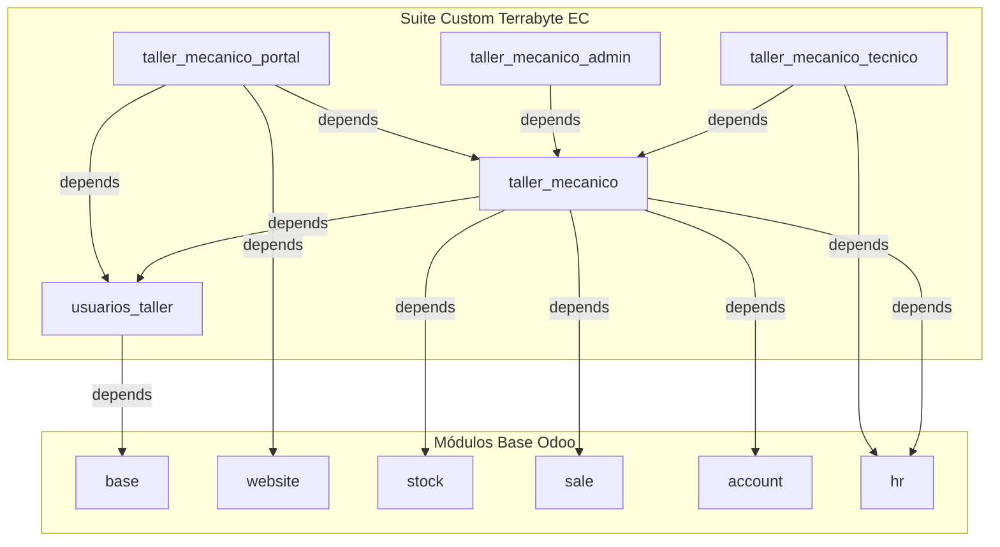

# 🏗️ Documentación técnica de arquitectura - Terrabyte EC

Esta documentación técnica describe en profundidad la arquitectura del **Sistema de Gestión de Taller Mecánico** para **Terrabyte EC**, detallando el diseño de componentes, flujos lógicos, dependencias de software e integraciones con servicios externos sobre Odoo 18.

---

## 1. Arquitectura funcional ⚙️

La arquitectura funcional organiza las capacidades del sistema en base a los procesos del negocio y los flujos de información requeridos para operar el taller mecánico de manera integral:

### Funcionalidades por Capas
1. **Interacción del Cliente (Portal):** Concentra la captación de prospectos y autoservicio. Permite al cliente agendar citas con validaciones dinámicas de agenda, seguir el estado operativo de su reparación ingresando la placa del auto o descargar directamente sus facturas en formatos XML y PDF autorizados.
2. **Control Operativo (Backend):** Administra el flujo del taller. Permite al Jefe de Taller asignar mecánicos y a estos últimos completar las listas físicas de recepción del vehículo y asociar las líneas de repuestos y horas de servicio.
3. **Manejo Tributario (SRI):** Firma digitalmente facturas utilizando criptografía asimétrica y el estándar XAdES-BES. Transmite y recupera las respuestas de autorización del SRI bajo el esquema offline de Ecuador.

---

## 2. Arquitectura lógica

El sistema está estructurado bajo el patrón **Modelo-Vista-Controlador (MVC)** característico de Odoo, adaptado para manejar controladores HTTP para la interfaz pública y vistas QWeb para la representación web frontend:

### Flujo Lógico de Datos
- **Frontend (XML/CSS/JS):** QWeb procesa las vistas dinámicas en el lado del servidor, inyectando variables dinámicas de stock y estados de órdenes.
- **Controladores (Python http.route):** Validan las entradas del usuario (como el formato de fecha de la cita o duplicidad de cédula) y llaman a los servicios del ORM.
- **ORM de Odoo (Modelos):** Administra las transacciones lógicas, ejecuta triggers automáticos (como el aprovisionamiento de accesos de empleados en `hr_employee.py` o el cálculo de kilometrajes en `orden_trabajo.py`) y persiste los datos en PostgreSQL de manera segura.

---

## 3. Arquitectura modular

La suite de módulos de **Terrabyte EC** funciona como un ecosistema modular de acoplamiento selectivo:

### Cohesión Modular
- **`usuarios_taller`:** Aísla completamente la lógica del perfil del cliente y sus validaciones nacionales ecuatorianas para evitar colisiones con el módulo estándar de Odoo.
- **`taller_mecanico` (Core):** Define el motor operativo del taller. Vincula vehículos, marcas, modelos y automatiza la transición de estados de órdenes de trabajo.
- **`taller_mecanico_portal`:** Modifica exclusivamente las vistas web públicas. Actúa como el puente de comunicación de cara al cliente final.
- **`taller_mecanico_tecnico`:** Extiende las vistas operativas de cara a los empleados e ingenieros mecánicos.
- **`taller_mecanico_admin`:** Encapsula la lógica contable fina y tableros tributarios.

---

## 4. Flujo completo del negocio

El siguiente diagrama detalla la orquestación completa de servicios en el ciclo de vida operativa de un vehículo dentro de **Terrabyte EC**:

```mermaid
stateDiagram-v2
    [*] --> PortalCita : Cliente reserva en línea
    PortalCita --> CitaSolicitada : Validaciones de fecha y horario pasadas
    
    state CitaSolicitada {
        [*] --> Creada : Odoo genera taller.cita
        Creada --> OrdenGenerada : Se crea taller.orden.trabajo en 'Recibido'
    }

    CitaSolicitada --> CitaConfirmada : Administrador aprueba
    CitaConfirmada --> AutoIngresado : Se envía confirmación por Correo

    state AutoIngresado {
        [*] --> Checklist : Técnico completa inspección física
        Checklist --> TrabajosActivos : Técnico asocia repuestos y servicios
        TrabajosActivos --> AutoListo : Se cambia a estado 'Listo'
    }

    AutoListo --> NotificacionListo : Envío automático de Email con breakdown de costos
    NotificacionListo --> FacturacionContable : Administrador ejecuta 'Facturar'

    state FacturacionContable {
        [*] --> GenerarXML : Odoo construye estructura SRI XML
        GenerarXML --> FirmarXML : Criptografía XAdES-BES con .p12
        FirmarXML --> EnviarSRI : Transmisión SOAP Recepción
        EnviarSRI --> AutorizarSRI : Transmisión SOAP Autorización
        AutorizarSRI --> FacturaAutorizada : SRI retorna AUTORIZADO
    }

    FacturaAutorizada --> Entregado : Envío automático de Email con PDF/XML al cliente
    Entregado --> [*] : Vehículo retirado por propietario
```

### Detalle del Flujo de Trabajo
1. **Reserva Web:** El flujo inicia en el portal. Odoo valida la disponibilidad y choques de fecha/hora en la base de datos para prevenir solapamientos. Al crearse la cita, un disparador ORM (`create` en `cita.py`) genera la orden de trabajo respectiva en estado "Recibido".
2. **Inspección e Insumos:** Al ingresar el vehículo, el técnico completa el checklist físico en Odoo (registrando rayones, gasolina, gata e insumos). A medida que agrega repuestos, el ORM los descuenta del inventario virtual.
3. **Control de Calidad:** Al culminar las reparaciones, la orden pasa a "Listo". Un trigger en `orden_trabajo.py` dispara una notificación por correo al cliente.
4. **Validación Fiscal:** El flujo contable toma el control. Odoo genera el XML, lo firma digitalmente con el certificado `.p12` de la compañía a través de la librería criptográfica local, y se conecta con el SRI de Ecuador. Si el SRI autoriza el documento, se despacha el correo final al cliente con sus facturas electrónicas oficiales adjuntas.
