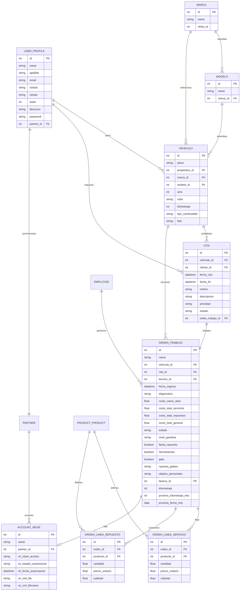

# Database Schema & Entity Relationship Documentation - Terrabyte EC

Esta documentación describe la estructura de persistencia de datos (base de datos relacional) para el **Sistema de Gestión de Taller Mecánico** de **Terrabyte EC**, detallando las tablas principales, tipos de datos, llaves primarias, llaves foráneas y restricciones lógicas en Odoo 18.

---

## 1. Entity Relationship Diagram (Diagrama de Entidades y Relaciones)

El siguiente diagrama de modelo entidad-relación (ER) ilustra la estructura lógica de los datos de la solución automotriz y contable:



## 2. Data Dictionary (Diccionario de Datos y Tablas)

A continuación se describen las tablas físicas equivalentes creadas por el ORM de Odoo para persistir la lógica de la suite automotriz:

### 2.1. Tabla: `usuarios_taller_user_profile` (usuarios_taller.user_profile)
Almacena las credenciales de validación y perfiles del portal web del taller automotriz.

| Campo (Columna) | Tipo de Datos SQL | Restricciones / Índices | Descripción |
| :--- | :--- | :--- | :--- |
| `id` | `INTEGER` | `PRIMARY KEY` (Auto-increment) | Identificador único de registro. |
| `cedula` | `VARCHAR` | `UNIQUE`, `NOT NULL` | Documento ecuatoriano único de identidad (10 dígitos). |
| `nombre` | `VARCHAR` | `NOT NULL` | Nombres del usuario. |
| `apellido` | `VARCHAR` | `NOT NULL` | Apellidos del usuario. |
| `email` | `VARCHAR` | `NOT NULL` | Dirección de correo. Validador de formato. |
| `direccion` | `VARCHAR` | `NOT NULL` | Domicilio registrado. |
| `password` | `VARCHAR` | `NOT NULL` | Contraseña encriptada para el portal web. |
| `celular` | `VARCHAR` | `NOT NULL` | Teléfono celular. Solo números. |
| `edad` | `INTEGER` | `NOT NULL` | Edad biológica. Valida mayor de edad (`>= 18`). |
| `partner_id` | `INTEGER` | `FOREIGN KEY` (ref: `res_partner.id`), `ON DELETE SET NULL` | Contacto de Odoo sincronizado para facturación. |

---

### 2.2. Tabla: `taller_vehiculo` (taller.vehiculo)
Guarda la hoja de identificación física y técnica de los automóviles del taller.

| Campo (Columna) | Tipo de Datos SQL | Restricciones / Índices | Descripción |
| :--- | :--- | :--- | :--- |
| `id` | `INTEGER` | `PRIMARY KEY` | Llave primaria. |
| `placa` | `VARCHAR` | `UNIQUE`, `NOT NULL` | Placa vehicular oficial de Ecuador (ej: AAA-1234). |
| `propietario_id` | `INTEGER` | `FOREIGN KEY` (ref: `usuarios_taller_user_profile.id`), `NOT NULL` | Propietario del auto. |
| `marca_id` | `INTEGER` | `FOREIGN KEY` (ref: `taller_marca.id`), `NOT NULL` | Marca vehicular. |
| `modelo_id` | `INTEGER` | `FOREIGN KEY` (ref: `taller_modelo.id`), `NOT NULL` | Modelo vehicular (filtrado por dominio de marca). |
| `anio` | `INTEGER` | `CHECK (anio > 1850 AND anio <= current_year)` | Año de fabricación del auto. |
| `color` | `VARCHAR` | - | Color de la carrocería. |
| `kilometraje` | `INTEGER` | - | Odómetro acumulativo. |
| `tipo_combustible` | `VARCHAR` | `CHECK` (Selection) | Tipo de carburante (Gasolina, Diésel, Híbrido, Eléctrico). |
| `foto` | `BYTEA` (Binary) | - | Foto digital de identificación del vehículo. |

---

### 2.3. Tabla: `taller_cita` (taller.cita)
Almacena el registro cronológico de reservas automotrices del taller.

| Campo (Columna) | Tipo de Datos SQL | Restricciones / Índices | Descripción |
| :--- | :--- | :--- | :--- |
| `id` | `INTEGER` | `PRIMARY KEY` | Llave primaria. |
| `vehiculo_id` | `INTEGER` | `FOREIGN KEY` (ref: `taller_vehiculo.id`), `NOT NULL` | Vehículo citado. |
| `cliente_id` | `INTEGER` | `FOREIGN KEY` (ref: `usuarios_taller_user_profile.id`), `NOT NULL` | Cliente solicitante. |
| `fecha_cita` | `TIMESTAMP` | `NOT NULL` | Fecha y hora programada del ingreso. |
| `fecha_fin` | `TIMESTAMP` | - | Hora estimada de salida (computada como `fecha_cita + 1 hora`). |
| `motivo` | `VARCHAR` | `NOT NULL` | Causa de visita (mantenimiento, revisión, fallas, colisión). |
| `descripcion` | `TEXT` | - | Observaciones iniciales detalladas por el cliente. |
| `prioridad` | `VARCHAR` | Default: `rutinario` | Nivel de urgencia (Rutinario, Mantenimiento, Urgente). |
| `estado` | `VARCHAR` | Default: `solicitada` | Estados de cita (solicitada, confirmada, cancelada). |
| `orden_trabajo_id` | `INTEGER` | `FOREIGN KEY` (ref: `taller_orden_trabajo.id`), `Readonly` | Orden técnica asociada. |

---

### 2.4. Tabla: `taller_orden_trabajo` (taller.orden.trabajo)
Concentra la información técnica operativa de las reparaciones del taller mecánico.

| Campo (Columna) | Tipo de Datos SQL | Restricciones / Índices | Descripción |
| :--- | :--- | :--- | :--- |
| `id` | `INTEGER` | `PRIMARY KEY` | Llave primaria. |
| `name` | `VARCHAR` | `UNIQUE` | Código autogenerado único (ej: PLACA-CLIENTE-AAAAMMDD). |
| `vehiculo_id` | `INTEGER` | `FOREIGN KEY` (ref: `taller_vehiculo.id`), `NOT NULL` | Vehículo bajo reparación. |
| `cita_id` | `INTEGER` | `FOREIGN KEY` (ref: `taller_cita.id`), `NULLABLE` | Cita origen de la orden. |
| `tecnico_id` | `INTEGER` | `FOREIGN KEY` (ref: `hr_employee.id`), `NULLABLE` | Mecánico calificado asignado. |
| `fecha_ingreso` | `TIMESTAMP` | Default: `now()` | Fecha oficial de ingreso físico. |
| `diagnostico` | `TEXT` | - | Notas técnicas del estado del vehículo. |
| `costo_mano_obra` | `DOUBLE PRECISION` | - | Costo fijo del mecánico por horas. |
| `costo_total_servicios`| `DOUBLE PRECISION`| Computado | Sumatoria de servicios aplicados. |
| `costo_total_repuestos`| `DOUBLE PRECISION`| Computado | Sumatoria de repuestos consumidos. |
| `costo_total_general`  | `DOUBLE PRECISION`| Computado | Gran Total General (Servicios + Repuestos + Mano de Obra). |
| `estado` | `VARCHAR` | Default: `recibido` | Estado de reparación (recibido, listo, entregado). |
| `nivel_gasolina` | `VARCHAR` | Default: `medio` | Combustible al ingresar (reserva, 1/4, 1/2, 3/4, lleno). |
| `llanta_repuesto` | `BOOLEAN` | Default: `TRUE` | Checklist: presencia de llanta de auxilio. |
| `herramientas` | `BOOLEAN` | Default: `TRUE` | Checklist: kit de herramientas presente. |
| `gata` | `BOOLEAN` | Default: `TRUE` | Checklist: gata hidráulica presente. |
| `rayones_golpes` | `TEXT` | - | Daños previos identificados en la carrocería. |
| `objetos_personales` | `TEXT` | - | Pertenencias y objetos de valor dejados en el auto. |
| `factura_id` | `INTEGER` | `FOREIGN KEY` (ref: `account_move.id`), `Readonly` | Factura contable generada. |
| `kilometraje` | `INTEGER` | - | Kilometraje al ingresar al taller. |
| `proximo_kilometraje_mto`| `INTEGER`| Computado | Próximo mantenimiento recomendado (`kilometraje + 5000 km`). |
| `proxima_fecha_mto` | `DATE` | Computado | Fecha límite recomendada (`fecha_ingreso + 180 días`). |

---

### 2.5. Tabla: `taller_orden_linea_servicio` (taller.orden.linea.servicio)
Líneas de mano de obra y servicios calificados aplicados al vehículo.

| Campo (Columna) | Tipo de Datos SQL | Restricciones / Índices | Descripción |
| :--- | :--- | :--- | :--- |
| `id` | `INTEGER` | `PRIMARY KEY` | Llave primaria. |
| `orden_id` | `INTEGER` | `FOREIGN KEY` (ref: `taller_orden_trabajo.id`), `ON DELETE CASCADE` | Orden padre. |
| `producto_id` | `INTEGER` | `FOREIGN KEY` (ref: `product_product.id`), `NOT NULL` | Catálogo de servicios estándar. |
| `cantidad` | `DOUBLE PRECISION` | Default: `1.0` | Horas o rubros del servicio. |
| `precio_unitario` | `DOUBLE PRECISION` | Relacionado | Tarifa por unidad de servicio. |
| `subtotal` | `DOUBLE PRECISION` | Computado | Subtotal (`cantidad * precio_unitario`). |

---

### 2.6. Tabla: `taller_orden_linea_repuesto` (taller.orden.linea.repuesto)
Líneas de materiales y repuestos sustraídos del inventario para la reparación.

| Campo (Columna) | Tipo de Datos SQL | Restricciones / Índices | Descripción |
| :--- | :--- | :--- | :--- |
| `id` | `INTEGER` | `PRIMARY KEY` | Llave primaria. |
| `orden_id` | `INTEGER` | `FOREIGN KEY` (ref: `taller_orden_trabajo.id`), `ON DELETE CASCADE` | Orden padre. |
| `producto_id` | `INTEGER` | `FOREIGN KEY` (ref: `product_product.id`), `NOT NULL` | Catálogo de repuestos automotrices. |
| `cantidad` | `DOUBLE PRECISION` | Default: `1.0` | Cantidad de repuestos consumidos. |
| `precio_unitario` | `DOUBLE PRECISION` | Relacionado | Costo del repuesto al público. |
| `subtotal` | `DOUBLE PRECISION` | Computado | Subtotal (`cantidad * precio_unitario`). |

---

## 3. SQL Constraints & Validations (Restricciones e Integridad de Base de Datos)

Para blindar la base de datos contra inconsistencias operativas, se ejecutan las siguientes validaciones a nivel de motor SQL de PostgreSQL:

1. **Unicidad de Cédulas (`usuarios_taller.user_profile`):**
   - Se inyecta la restricción de base de datos `cedula_unique` para evitar registros de perfiles duplicados:
   ```sql
   ALTER TABLE usuarios_taller_user_profile ADD CONSTRAINT cedula_unique UNIQUE(cedula);
   ```
2. **Unicidad de Placas Vehiculares (`taller.vehiculo`):**
   - Odoo aplica la directiva `required=True` en la placa, previniendo duplicidades lógicas mediante la indexación única del campo para búsquedas de estado veloces por parte del cliente.
3. **Consistencia de Marcas y Modelos (`taller.vehiculo`):**
   - El formulario y el backend del portal aplican un filtro de integridad referencial (`domain="[('marca_id', '=', marca_id)]"`) a nivel de base de datos relacional para evitar la inserción de combinaciones imposibles (ej. Marca: Toyota, Modelo: Civic).
4. **Integridad Referencial en Cascadas (`ON DELETE`):**
   - La eliminación de una Orden de Trabajo (`taller.orden.trabajo`) limpia de manera síncrona en cascada (`ON DELETE CASCADE`) todas sus líneas de detalle asociadas (`taller.orden.linea.servicio` y `taller.orden.linea.repuesto`), evitando registros huérfanos e inconsistencias de almacenamiento.
